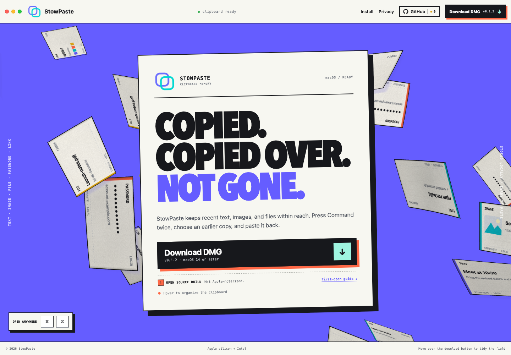

<div align="center">
  

  <h1>StowPaste</h1>

  <p><strong>Copied. Kept. Ready when you are.</strong></p>
  <p>A quiet macOS clipboard history utility that lives in the menu bar. Copy text, images, or files, then tap the left Command key twice to bring them back.</p>

  <p>
    
    
    
    
    
  </p>

  <p>
    <a href="README.zh-CN.md">简体中文</a>
    ·
    <a href="README.md"><strong>English</strong></a>
  </p>
</div>

> [!IMPORTANT]
> ### [↓ Download StowPaste v0.1.1 (DMG)](https://github.com/TseringYuu/stowpaste/releases/download/v0.1.1/StowPaste-v0.1.1.dmg)
> For macOS 14 or later on Apple silicon and Intel Macs. No account required.

<p align="center">
  <a href="https://stowpaste.aiware.store"><strong>Visit the website</strong></a>
  &nbsp;·&nbsp;
  <a href="https://stowpaste.aiware.store/docs">Guide</a>
  &nbsp;·&nbsp;
  <a href="https://stowpaste.aiware.store/privacy">Privacy</a>
  &nbsp;·&nbsp;
  <a href="https://github.com/TseringYuu/stowpaste/releases/download/v0.1.1/StowPaste-v0.1.1.dmg.sha256">SHA-256</a>
</p>



## Back to what you copied in three steps

| 1. Copy | 2. Open | 3. Paste |
| --- | --- | --- |
| Copy text, an image, or a file as usual. | Tap the left Command key twice (⌘⌘). The panel appears near your current work. | Choose a history item with the keyboard or mouse and paste it back into the active app. |

## Designed for repeated pasting

| | Capability | What it does |
| --- | --- | --- |
| **⌘⌘** | Open from anywhere | Double-tap the left Command key by default, or record another shortcut in Settings. StowPaste stays in the menu bar without a Dock icon. |
| **TEXT / IMAGE / FILE** | Keep each kind recognizable | Store text, image, and file history. Images have previews and a dedicated group; files retain useful name and location details. |
| **GROUPS** | Build your own order | Favorite, pin, delete, and rename items. Create, edit, and reorder groups, then drag content directly onto a group tab. |
| **PANEL** | Fit the current workspace | Navigate by keyboard or mouse. Move and resize the panel, or pin it on screen when you need it to stay visible. |
| **THEMES** | Make it feel at home | Follow the system light or dark appearance, or generate and save a custom color theme locally. |
| **RETENTION** | Decide what stays | Choose how long ordinary history remains. Favorites, pinned items, and custom-group items are protected from scheduled cleanup. |

## Install

1. Download and open the [StowPaste v0.1.1 DMG](https://github.com/TseringYuu/stowpaste/releases/download/v0.1.1/StowPaste-v0.1.1.dmg).
2. Drag `StowPaste.app` onto the Applications shortcut in the disk image.
3. Launch StowPaste from Applications. macOS may say it cannot verify the developer.
4. Open System Settings → Privacy & Security, scroll to Security, and choose **Open Anyway** for StowPaste. Authenticate if prompted.
5. Grant Accessibility permission when prompted. If the settings page does not open automatically, go to System Settings → Privacy & Security → Accessibility and enable StowPaste.

Accessibility permission lets StowPaste listen for the global shortcut, restore the previous input focus, and paste the selected item into the active app.

> [!NOTE]
> `v0.1.1` is an independent open-source build that does not use a paid Apple Developer account. The application uses an identity-free ad-hoc signature; the app and disk image are not Developer ID signed or notarized by Apple. Review the source and checksum before creating the one-app exception above. Never disable Gatekeeper globally.
>
> When updating, quit the currently running copy before replacing it. If System Settings shows StowPaste enabled under Accessibility but the app still asks for permission, remove the old StowPaste entry, add `/Applications/StowPaste.app` again with the `+` button, then quit and reopen StowPaste.

<details>
<summary><strong>Verify the disk image</strong></summary>

Download the official checksum file or run:

```bash
shasum -a 256 StowPaste-v0.1.1.dmg
```

Expected SHA-256:

```text
8c59146c080aacc539ea6f798ee9007dd5731dd116d7000efc416715cd4ef814
```

</details>

Technical users can also review and build StowPaste locally. See the [Development Guide](docs/DEVELOPMENT.md) for the required toolchain and verified commands.

## Use StowPaste

### Open and paste

- Tap the left Command key twice (⌘⌘) to open the paste panel by default.
- Or click the menu bar icon and choose “Show Main Panel.”
- The panel prefers the active insertion point. With no focused text field, it chooses a suitable position near the pointer.
- Click a history item to paste it. Press the shortcut again while the panel is open to paste the current clipboard item quickly.

### Organize history

- Favorite frequently used content or pin important items.
- Rename entries that are difficult to recognize at a glance.
- Create custom groups, edit their names and icons, and reorder them.
- Drag an item onto a group tab to classify it.
- Delete content you no longer need. The entry matching the current clipboard is protected against accidental deletion.

### Shape the workflow

- Move and resize the panel to fit the current display and window layout.
- Pin the panel on screen for a sequence of paste actions.
- Choose System, Light, Dark, or a local custom theme.
- Set a history retention period and enable launch at login when useful.

## Local data and privacy

- Clipboard history, images, and settings stay in the current Mac's Application Support directory.
- The current version requires no account and does not upload clipboard content to external services.
- Custom themes are generated on-device; theme descriptions are not sent to an external service.
- Logs and application state may include clipboard-related information. Do not share unreviewed files publicly.

See the full [StowPaste privacy page](https://stowpaste.aiware.store/privacy).

## Repository layout

```text
packages/app/         SwiftUI / AppKit macOS application
packages/website/     Website, guide, and download API
Scripts/              Build, packaging, and verification scripts
docs/                 Maintainer documentation and README assets
```

Common development commands:

```bash
npm install
swift build --package-path packages/app
npm run website:build
./Scripts/verify_all.sh
```

Maintainer references: [Development Guide](docs/DEVELOPMENT.md), [Security Policy](SECURITY.md), and [Changelog](CHANGELOG.md).

## License

StowPaste is open source under the [Apache License 2.0](LICENSE). You may use, modify, distribute, and commercially use the project while retaining applicable copyright, license, and NOTICE statements. Third-party components remain under their own licenses; see [THIRD_PARTY_NOTICES.md](THIRD_PARTY_NOTICES.md).

Read the [Contributing Guide](CONTRIBUTING.md) before submitting a change.
